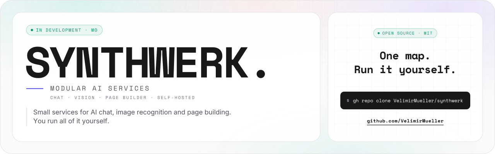

<picture>
  <source media="(prefers-color-scheme: dark)" srcset="assets/banner/banner-v2-dark.svg">
  
</picture>

<p align="center">
  <a href="#roadmap"></a>
  <a href="#principles"></a>
  <a href="LICENSE"></a>
</p>

**Synthwerk** is a set of small services for AI chat, image recognition and page building. You run all of it yourself.

```text
[ STATUS ]  M0 clean slate, 2026-10
[ WORKS  ]  blueprint, tokens, vision
[ NEXT   ]  M1: spine runs locally
```

## In 30 seconds

- Each part is a separate repo `synthwerk-<role>`. This repo is the map.
- Drop the widgets into a website, or build your own app with the SDK.
- In development, models run on your machine. No paid AI provider is needed.
- Today: the blueprint, the design tokens and the vision classifier work. The other services are planned or in rewrite.

## Ecosystem

```text
-- 02 ----------------------------------------------------- ECOSYSTEM --

   your website             your app                 you, the operator
        |                       |                            |
 +------v-------+       +-------v------+             +-------v------+
 |   widgets    |       |     sdk      |             |    studio    |
 | chat, vision |       | npm packages |             | build, admin |
 +------+-------+       +-------+------+             +-------+------+
        |                       |                            |
        +-----------------------+----------------------------+
                                | HTTPS
 +------------------------------v-----------------------------------+
 |  edge     TLS  /  WAF  /  rate limit             (from infra)    |
 +-----+--------------+--------------+--------------+----------+----+
       |              |              |              |          :
 +-----v----+   +-----v----+   +-----v----+   +-----v----+  +..v.........+
 | identity |   |   llm    |   |  vision  |   |  pulse   |  :  Strobe    :
 | orgs     |   | chat     |   | image    |   | health   |  :  mascot    :
 | roles    |   | gateway  |   | labels   |   | audit    |  :  public    :
 +-----+----+   +-----+----+   +-----+----+   +-----+----+  +............+
       |              |              |              |        isolated: no
 ======+==============+==============+==============+=====   tools, no db,
   NATS event bus  (CloudEvents, facts only)                  no egress

 contracts  OpenAPI + event schemas --> generated clients
 infra      servers, compose stack, edge, bus, repo settings
 e2e        Playwright tests across all services
 blueprint  shared CI, lint configs, templates for every repo
```

- Each service and front end is a `synthwerk-<name>` repo. `synthwerk-infra` configures the edge and the bus.
- The llm service reads the other services through read-only MCP tools.
- **Strobe** is the public mascot: a no-login helper on the website. It is isolated from all other services. The name is not final.

## Repos

| Repo | Role | Language | Status |
|---|---|---|---|
| [synthwerk-blueprint](https://github.com/VelimirMueller/synthwerk-blueprint) | Shared CI workflows, lint configs, templates, feature-doc skill | YAML, JS |  |
| [synthwerk-sdk](https://github.com/VelimirMueller/synthwerk-sdk) | npm packages: design tokens now, SDK later | TypeScript |  |
| [synthwerk-vision](https://github.com/VelimirMueller/synthwerk-vision) | Image labels with an open vocabulary and a topic tree | Python |  |
| [synthwerk-identity](https://github.com/VelimirMueller/synthwerk-identity) | Orgs, roles, entitlements, paywall (login by Zitadel) | Go |  |
| [synthwerk-llm](https://github.com/VelimirMueller/synthwerk-llm) | LLM gateway, streaming chat, mascot binary | Go |  |
| [synthwerk-widgets](https://github.com/VelimirMueller/synthwerk-widgets) | Embeddable chat and vision widgets | Vue 3.5 |  |
| [synthwerk-studio](https://github.com/VelimirMueller/synthwerk-studio) | Public site, page builder, admin, live health | Nuxt 4 |  |
| `synthwerk-contracts` | OpenAPI, event schemas, generated clients | OpenAPI, JSON Schema |  |
| `synthwerk-infra` | Servers, compose stack, edge, repo settings | OpenTofu |  |
| `synthwerk-pulse` | Health, audit log, KPIs over SSE | Go |  |
| `synthwerk-e2e` | End-to-end tests across all services | Playwright |  |

- "Rewrite planned": the repo has a new README. The old code is kept at the tag `legacy-final`.
- A repo without a link does not exist yet.

## Two ways to use it

```text
-- 04 -------------------------------------------- TWO WAYS TO USE IT --

  DROP IN                                 BUILD
  +----------------------------+          +----------------------------+
  | <script src=".../loader">  |          | $ npm i @synthwerk/vue     |
  | chat + vision on any page  |          | your app, same services    |
  +----------------------------+          +----------------------------+
```

| | Drop in | Build |
|---|---|---|
| **You get** | Chat and vision widgets plus sign-in, on any page | Your own app on the same services |
| **You use** | One loader script on your page. Settings in studio. | `@synthwerk/react` or `@synthwerk/vue`, `@synthwerk/tokens` |
| **Sign-in** | Required for AI calls. Passkeys and MFA. | Same accounts and roles |
| **Ready** | Milestone M2 (planned) | Tokens now. SDK at milestone M5 (planned). |

- The loader script and the SDK packages do not exist yet. The names are the plan.

## Principles

- **Local-first.** Development uses local models. Vision runs on CPU with ONNX and calls no external API.
- **Isolated public mascot.** Strobe has no tools, no database and no network egress. It uses a local model only.
- **Scope on the token, not the prompt.** Each service checks the scope in the user's token. A prompt cannot change access.
- **Events for facts.** Services publish facts as CloudEvents on NATS. Questions use HTTP.
- **No anonymous AI.** Chat and vision need a signed-in user. Only the mascot is public.

## Roadmap

```text
-- 06 ------------------------------------------------------- ROADMAP --

  M0       M1       M2       M3       M4       M5       M6
  [>>]-----[  ]-----[  ]-----[  ]-----[  ]-----[  ]-----[  ]
  2026-10  2026-11  2027-01  2027-02  2027-04  2027-05  2027-06
  clean    spine    chat     MVP      public   paid +   cluster
  slate    local    on dev   on prd   demo     SDK      ready

  [>>] in progress    [  ] planned    [##] done
```

| Milestone | Proof | Target | Status |
|---|---|---|---|
| M0 Clean slate | Old names removed. Blueprint CI green in a repo. | 2026‑10 |  |
| M1 Spine runs locally | `docker compose up` starts edge, bus, database, telemetry, pulse | 2026‑11 |  |
| M2 Chat slice on dev | A passkey user gets streamed answers in an embedded chat | 2027‑01 |  |
| M3 MVP on prd | The approved stg build runs on prd. Restore drill done. | 2027‑02 |  |
| M4 Public demo | Public site with live chat, vision and the mascot | 2027‑04 |  |
| M5 Paid plans and SDK apps | Checkout changes entitlements. App templates for React and Vue. | 2027‑05 |  |
| M6 Cluster-ready | Same images on k3s. Security review closed. Card scan works. | 2027‑06 |  |

- Targets are estimates.

## How the repos fit

```text
-- 07 --------------------------------------------- HOW THE REPOS FIT --

 +----------+  PR + checks  +--------+     auto      +-------+
 |  feat/*  | ------------> |  main  | ------------> |  dev  |
 +----------+               +--------+               +---+---+
                                                         |
                                                         | tag vX.Y.Z
                                                         |
 +-------+   manual approval   +-------+                 |
 |  prd  | <------------------ |  stg  | <---------------+
 +-------+                     +-------+

  trunk-based: no env branches. one image, built once, promoted by digest.
```

- **Trunk-based.** There are no environment branches. One image is built once and promoted by digest.
- **One blueprint.** Every repo calls the blueprint workflows at `@v1` and uses the same README and feature-doc layout.
- **One contract.** APIs and events are defined in `synthwerk-contracts`. Clients are generated from it.
- No service deploys yet. This flow is the target for milestone M1 and later.

## Docs

- [Blueprint README](https://github.com/VelimirMueller/synthwerk-blueprint#readme): how a repo adopts the shared CI and templates.
- [Definition of Ready](https://github.com/VelimirMueller/synthwerk-blueprint/blob/main/docs/process/definition-of-ready.md) and [Definition of Done](https://github.com/VelimirMueller/synthwerk-blueprint/blob/main/docs/process/definition-of-done.md).
- [Repo templates](https://github.com/VelimirMueller/synthwerk-blueprint/tree/main/templates/_common) and [caller workflows](https://github.com/VelimirMueller/synthwerk-blueprint/tree/main/examples/workflows).
- [Design tokens](https://github.com/VelimirMueller/synthwerk-sdk/tree/main/packages/tokens): colours and themes.
- [Presence style guide](docs/presence-style.md): colours, fonts, ASCII rules and the README layout for every repo.
- [MAINTAINING.md](MAINTAINING.md): manual steps for this repo.

```text
 █████  ██  ██  ██  ██  ██████  ██  ██  ██   ██  ██████  █████   ██  ██
██      ██  ██  ███ ██    ██    ██  ██  ██   ██  ██      ██  ██  ██ ██
 ████    ████   ██████    ██    ██████  ██ █ ██  █████   █████   ████
    ██    ██    ██ ███    ██    ██  ██  ███████  ██      ██ ██   ██ ██
█████     ██    ██  ██    ██    ██  ██   ██ ██   ██████  ██  ██  ██  ██  ██

 ------  modular AI services that you run yourself  -----------------------
```

[MIT](LICENSE) © 2026 Velimir Mueller
