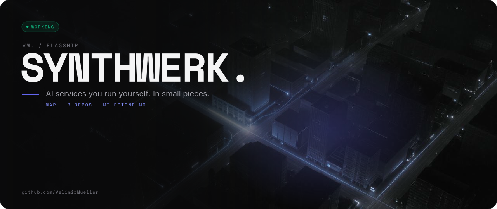
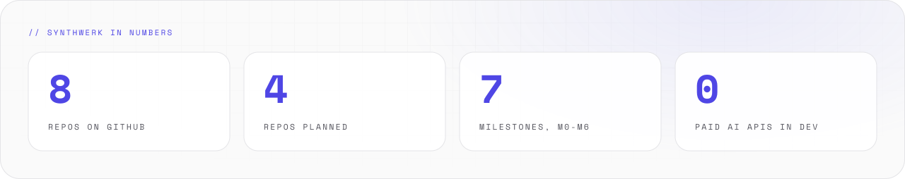
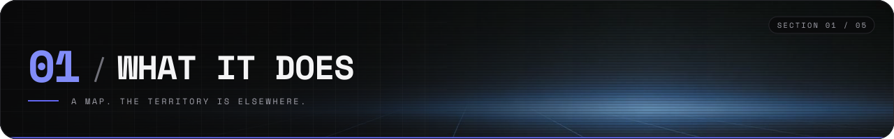
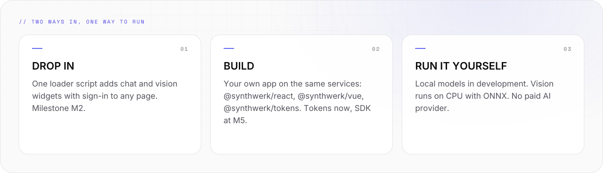
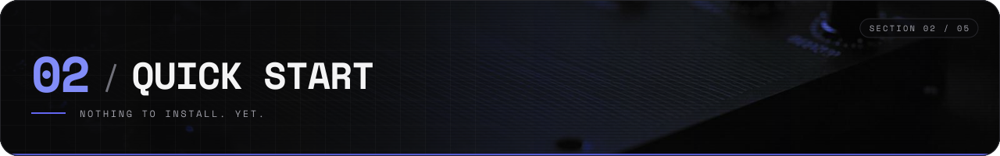
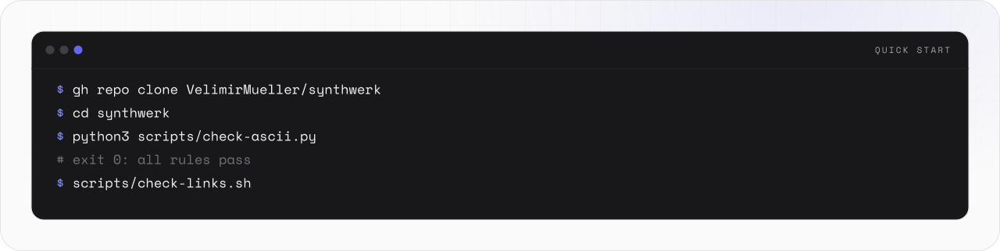
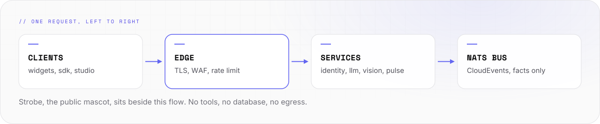
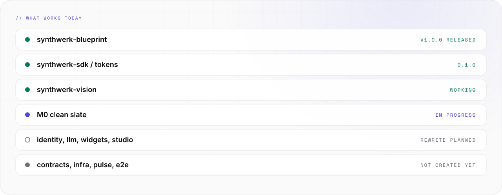

<picture>
  <source media="(prefers-color-scheme: light)" srcset="assets/banner/hero-v2-light.svg">
  
</picture>

<p align="center">

[](#-05-status) [](https://github.com/VelimirMueller) [](LICENSE) [](#principles)

</p>

> AI services you run yourself. In small pieces.

```text
 █████  ██  ██  ██  ██  ██████  ██  ██  ██   ██  ██████  █████   ██  ██
██      ██  ██  ███ ██    ██    ██  ██  ██   ██  ██      ██  ██  ██ ██
 ████    ████   ██████    ██    ██████  ██ █ ██  █████   █████   ████
    ██    ██    ██ ███    ██    ██  ██  ███████  ██      ██ ██   ██ ██
█████     ██    ██  ██    ██    ██  ██   ██ ██   ██████  ██  ██  ██  ██  ██

 ------  modular AI services that you run yourself  -----------------------
```

**Synthwerk** is a set of small services for AI chat, image recognition and page building. You run all of it yourself.
This repo is the map. It contains no service. It is very good at that.

<picture>
  <source media="(prefers-color-scheme: dark)" srcset="assets/readme/stats-v2-dark.svg">
  
</picture>

<br>

## // 01 WHAT IT DOES



<picture>
  <source media="(prefers-color-scheme: dark)" srcset="assets/readme/features-v2-dark.svg">
  
</picture>

- Each part is a separate repo `synthwerk-<role>`. This repo is the map.
- Drop the widgets into a website, or build your own app with the SDK.
- In development, models run on your machine. No paid AI provider is needed.
- Today the blueprint, the design tokens and the vision classifier work. The other services are planned or in rewrite.

<br>

## // 02 QUICK START



<picture>
  <source media="(prefers-color-scheme: dark)" srcset="assets/readme/start-v2-dark.svg">
  
</picture>

No service runs yet. The quick start is: get the map, check the map.

```bash
gh repo clone VelimirMueller/synthwerk
cd synthwerk
python3 scripts/check-ascii.py   # README.md and assets/ascii
scripts/check-links.sh           # checks README.md
```

- Start with the [blueprint](https://github.com/VelimirMueller/synthwerk-blueprint#readme) if you want to adopt the shared CI.
- `docker compose up` arrives with milestone M1.

<br>

## // 03 HOW IT WORKS


<picture>
  <source media="(prefers-color-scheme: dark)" srcset="assets/readme/flow-v2-dark.svg">
  
</picture>

```text
 feat/* --PR + checks--> main --auto--> dev --tag vX.Y.Z--> stg
                                                             |
                                          prd <--manual------+
                                               approval

 trunk-based. no env branches. one image, built once,
 promoted by digest.
```

- **Trunk-based.** There are no environment branches. One image is built once and promoted by digest.
- **One blueprint.** Every repo calls the blueprint workflows at `@v1` and uses the same README and feature-doc layout.
- **One contract.** APIs and events are defined in `synthwerk-contracts`. Clients are generated from it.
- The llm service reads the other services through read-only MCP tools.
- No service deploys yet. This flow is the target for milestone M1 and later.
- The full ecosystem diagram is in [docs/architecture.md](docs/architecture.md).

<br>

## // 04 USAGE


### The repos

- [synthwerk-blueprint](https://github.com/VelimirMueller/synthwerk-blueprint): shared CI workflows, lint configs, templates, feature-doc skill. YAML, JS. v1.0.0 released.
- [synthwerk-sdk](https://github.com/VelimirMueller/synthwerk-sdk): npm packages. Design tokens now, SDK later. TypeScript. tokens 0.1.0.
- [synthwerk-vision](https://github.com/VelimirMueller/synthwerk-vision): image labels with an open vocabulary and a topic tree. Python. Working.
- [synthwerk-identity](https://github.com/VelimirMueller/synthwerk-identity): orgs, roles, entitlements, paywall. Login by Zitadel. Go. Rewrite planned.
- [synthwerk-llm](https://github.com/VelimirMueller/synthwerk-llm): LLM gateway, streaming chat, mascot binary. Go. Rewrite planned.
- [synthwerk-widgets](https://github.com/VelimirMueller/synthwerk-widgets): embeddable chat and vision widgets. Vue 3.5. Rewrite planned.
- [synthwerk-studio](https://github.com/VelimirMueller/synthwerk-studio): public site, page builder, admin, live health. Nuxt 4. Rewrite planned.
- `synthwerk-contracts`: OpenAPI, event schemas, generated clients. OpenAPI, JSON Schema. Planned.
- `synthwerk-infra`: servers, compose stack, edge, repo settings. OpenTofu. Planned.
- `synthwerk-pulse`: health, audit log, KPIs over SSE. Go. Planned.
- `synthwerk-e2e`: end-to-end tests across all services. Playwright. Planned.

"Rewrite planned" means the repo has a new README. The old code is kept at the tag `legacy-final`.
A repo without a link does not exist yet.

### Two ways to use it

- **Drop in.** One loader script on your page gives chat and vision widgets plus sign-in. Settings live in studio. Ready at milestone M2 (planned).
- **Build.** Your own app on the same services with `@synthwerk/react` or `@synthwerk/vue`, and `@synthwerk/tokens`. Tokens now. SDK at milestone M5 (planned).
- **Sign-in.** AI calls need a signed-in user. Passkeys and MFA. Both ways use the same accounts and roles.
- The loader script and the SDK packages do not exist yet. The names are the plan.

### Principles

- **Local-first.** Development uses local models. Vision runs on CPU with ONNX and calls no external API.
- **Isolated public mascot.** Strobe is a no-login helper on the website. It has no tools, no database and no network egress. It uses a local model only. The name is not final.
- **Scope on the token, not the prompt.** Each service checks the scope in the user's token. A prompt cannot change access.
- **Events for facts.** Services publish facts as CloudEvents on NATS. Questions use HTTP.
- **No anonymous AI.** Chat and vision need a signed-in user. Only the mascot is public.

### Roadmap

```text
  M0       M1       M2       M3       M4       M5       M6
  [>>]-----[  ]-----[  ]-----[  ]-----[  ]-----[  ]-----[  ]
  2026-10  2026-11  2027-01  2027-02  2027-04  2027-05  2027-06
  clean    spine    chat     MVP      public   paid +   cluster
  slate    local    on dev   on prd   demo     SDK      ready

  [>>] in progress    [  ] planned    [##] done
```

- **M0 Clean slate**, 2026‑10, in progress. Old names removed. Blueprint CI green in a repo.
- **M1 Spine runs locally**, 2026‑11, planned. `docker compose up` starts edge, bus, database, telemetry, pulse.
- **M2 Chat slice on dev**, 2027‑01, planned. A passkey user gets streamed answers in an embedded chat.
- **M3 MVP on prd**, 2027‑02, planned. The approved stg build runs on prd. Restore drill done.
- **M4 Public demo**, 2027‑04, planned. Public site with live chat, vision and the mascot.
- **M5 Paid plans and SDK apps**, 2027‑05, planned. Checkout changes entitlements. App templates for React and Vue.
- **M6 Cluster-ready**, 2027‑06, planned. Same images on k3s. Security review closed. Card scan works.
- Targets are estimates. Estimates are not promises. This line is.

### Docs

- [Blueprint README](https://github.com/VelimirMueller/synthwerk-blueprint#readme): how a repo adopts the shared CI and templates.
- [Definition of Ready](https://github.com/VelimirMueller/synthwerk-blueprint/blob/main/docs/process/definition-of-ready.md) and [Definition of Done](https://github.com/VelimirMueller/synthwerk-blueprint/blob/main/docs/process/definition-of-done.md).
- [Repo templates](https://github.com/VelimirMueller/synthwerk-blueprint/tree/main/templates/_common) and [caller workflows](https://github.com/VelimirMueller/synthwerk-blueprint/tree/main/examples/workflows).
- [Design tokens](https://github.com/VelimirMueller/synthwerk-sdk/tree/main/packages/tokens): colours and themes.
- [Architecture](docs/architecture.md): the full ecosystem, two-ways, roadmap and repo-flow diagrams.
- [Presence style guide](docs/presence-style.md): colours, fonts, ASCII rules and the README layout for every repo.
- [MAINTAINING.md](MAINTAINING.md): manual steps for this repo.

<br>

## // 05 STATUS


<picture>
  <source media="(prefers-color-scheme: dark)" srcset="assets/readme/status-v2-dark.svg">
  
</picture>

```text
[ STATUS ]  M0 clean slate, 2026-10
[ WORKS  ]  blueprint, tokens, vision
[ NEXT   ]  M1: spine runs locally
```

There are no tests in this repo. There is no code to test. The checks cover the words and the links:

```bash
python3 scripts/check-ascii.py   # exit 0: all rules pass
scripts/check-links.sh           # exit 0: all links resolve
```

<br>

```text
-- EOF ------------------------------------- THE MAP IS NOT THE CITY --
```

---

<sub>VM. studio / flagship · open source · look per <code>vm-brand</code> playbook · [MIT](LICENSE) © 2026 Velimir Mueller</sub>
