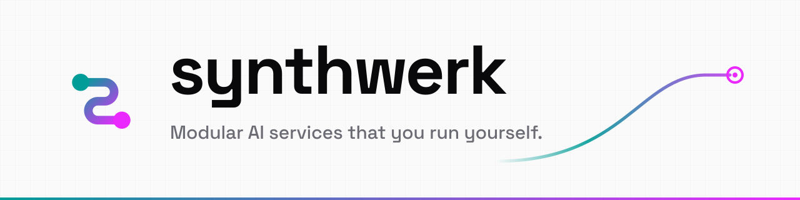
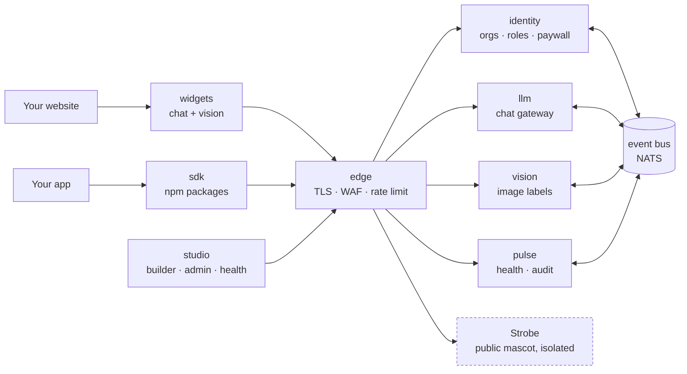
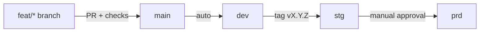

<picture>
  <source media="(prefers-color-scheme: dark)" srcset="assets/banner/banner-dark.svg">
  
</picture>

**Synthwerk** is a set of small services for AI chat, image recognition and page building. You run all of it yourself.

## In 30 seconds

- Each part is a separate repo `synthwerk-<role>`. This repo is the map.
- Drop the widgets into a website, or build your own app with the SDK.
- In development, models run on your machine. No paid AI provider is needed.
- Today: the blueprint, the design tokens and the vision classifier work. The other services are planned or in rewrite.

## Ecosystem

- Each service and front end is a `synthwerk-<name>` repo. `synthwerk-infra` configures the edge and the bus.
- The llm service reads the other services through read-only MCP tools.
- **Strobe** is the public mascot: a no-login helper on the website. It is isolated from all other services. The name is not final.

## Repos

| Repo | Role | Language | Status |
|---|---|---|---|
| [synthwerk-blueprint](https://github.com/VelimirMueller/synthwerk-blueprint) | Shared CI workflows, lint configs, templates, feature-doc skill | YAML · JS |  |
| [synthwerk-sdk](https://github.com/VelimirMueller/synthwerk-sdk) | npm packages: design tokens now, SDK later | TypeScript |  |
| [synthwerk-vision](https://github.com/VelimirMueller/synthwerk-vision) | Image labels with an open vocabulary and a topic tree | Python |  |
| [synthwerk-identity](https://github.com/VelimirMueller/synthwerk-identity) | Orgs, roles, entitlements, paywall (login by Zitadel) | Go |  |
| [synthwerk-llm](https://github.com/VelimirMueller/synthwerk-llm) | LLM gateway, streaming chat, mascot binary | Go |  |
| [synthwerk-widgets](https://github.com/VelimirMueller/synthwerk-widgets) | Embeddable chat and vision widgets | Vue 3.5 |  |
| [synthwerk-studio](https://github.com/VelimirMueller/synthwerk-studio) | Public site, page builder, admin, live health | Nuxt 4 |  |
| `synthwerk-contracts` | OpenAPI, event schemas, generated clients | OpenAPI · JSON Schema |  |
| `synthwerk-infra` | Servers, compose stack, edge, repo settings | OpenTofu |  |
| `synthwerk-pulse` | Health, audit log, KPIs over SSE | Go |  |
| `synthwerk-e2e` | End-to-end tests across all services | Playwright |  |

- "Rewrite planned": the repo has a new README. The old code is kept at the tag `legacy-final`.
- A repo without a link does not exist yet.

## Two ways to use it

| | Drop in | Build |
|---|---|---|
| **You get** | Chat and vision widgets plus sign-in, on any page | Your own app on the same services |
| **You use** | One loader script on your page. Settings in studio. | `@synthwerk/react` or `@synthwerk/vue`, `@synthwerk/tokens` |
| **Sign-in** | Required for AI calls. Passkeys and MFA. | Same accounts and roles |
| **Ready** | Milestone M2 (planned) | Tokens now. SDK at milestone M5 (planned). |

## Principles

- **Local-first.** Development uses local models. Vision runs on CPU with ONNX and calls no external API.
- **Isolated public mascot.** Strobe has no tools, no database and no network egress. It uses a local model only.
- **Scope on the token, not the prompt.** Each service checks the scope in the user's token. A prompt cannot change access.
- **Events for facts.** Services publish facts as CloudEvents on NATS. Questions use HTTP.
- **No anonymous AI.** Chat and vision need a signed-in user. Only the mascot is public.

## Roadmap

| Milestone | Proof | Target | Status |
|---|---|---|---|
| M0 Clean slate | Old names removed. Blueprint CI green in a repo. | 2026‑10 |  |
| M1 Spine runs locally | `docker compose up` starts edge, bus, database, telemetry, pulse | 2026‑11 |  |
| M2 Chat slice on dev | A passkey user gets streamed answers in an embedded chat | 2027‑01 |  |
| M3 MVP on prd | The approved stg build runs on prd. Restore drill done. | 2027‑02 |  |
| M4 Public demo | Public site with live chat, vision and the mascot | 2027‑04 |  |
| M5 Paid plans and SDK apps | Checkout changes entitlements. App templates for React and Vue. | 2027‑05 |  |
| M6 Cluster-ready | Same images on k3s. Security review closed. Card scan works. | 2027‑06 |  |

- Targets are estimates.

## How the repos fit

- **Trunk-based.** There are no environment branches. One image is built once and promoted by digest.
- **One blueprint.** Every repo calls the blueprint workflows at `@v1` and uses the same README and feature-doc layout.
- **One contract.** APIs and events are defined in `synthwerk-contracts`. Clients are generated from it.
- No service deploys yet. This flow is the target for milestone M1 and later.

## Docs

- [Blueprint README](https://github.com/VelimirMueller/synthwerk-blueprint#readme): how a repo adopts the shared CI and templates.
- [Definition of Ready](https://github.com/VelimirMueller/synthwerk-blueprint/blob/main/docs/process/definition-of-ready.md) and [Definition of Done](https://github.com/VelimirMueller/synthwerk-blueprint/blob/main/docs/process/definition-of-done.md).
- [Repo templates](https://github.com/VelimirMueller/synthwerk-blueprint/tree/main/templates/_common) and [caller workflows](https://github.com/VelimirMueller/synthwerk-blueprint/tree/main/examples/workflows).
- [Design tokens](https://github.com/VelimirMueller/synthwerk-sdk/tree/main/packages/tokens): colours, themes and the logo files.
- [MAINTAINING.md](MAINTAINING.md): manual steps for this repo.

## License

[MIT](LICENSE) © 2026 Velimir Mueller
