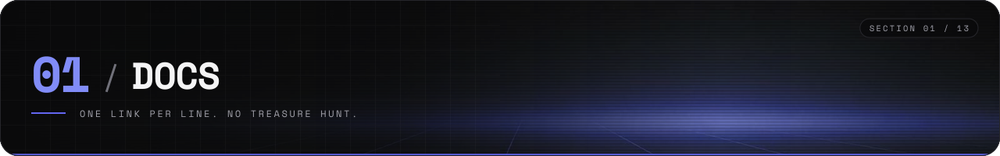
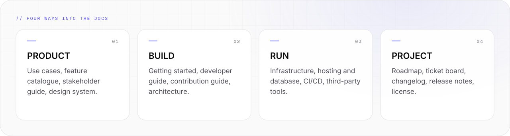

# Synthwerk docs



The index of everything about Synthwerk. One line per topic, one link per line.

```text
-- 00 ------------------------------------------------------------ DOCS --

  product          build              run                 project
  use cases        getting started    infrastructure      roadmap
  features         developer guide    hosting + database  ticket board
  stakeholders     contributing       CI/CD               changelog
  design system    architecture       third-party tools   release notes
```

A line marked `planned` names a thing that does not exist yet. The page says when it arrives.

<picture>
  <source media="(prefers-color-scheme: dark)" srcset="../assets/docs/index-areas-v1-dark.svg">
  
</picture>

## Product

| Topic | Where | State |
|---|---|---|
| Use cases | [use-cases.md](use-cases.md) | written |
| Feature catalogue | [feature-catalogue.md](feature-catalogue.md) | written, MVP = E0–E4 |
| Stakeholder guide | [stakeholder-guide.md](stakeholder-guide.md) | written |
| Demo application | [infrastructure.md](infrastructure.md#demo-stack) | planned, milestone M2 on the dev host |

## Design

| Topic | Where | State |
|---|---|---|
| Design system | [design-system.md](design-system.md) | tokens 0.2.0 released, components planned |
| Design tokens | [synthwerk-sdk / packages/tokens](https://github.com/VelimirMueller/synthwerk-sdk/tree/main/packages/tokens) | released |
| Presence style guide | [presence-style.md](presence-style.md) | written |
| Figma library | [design-system.md](design-system.md#figma) | planned |

## Build

| Topic | Where | State |
|---|---|---|
| Getting started | [getting-started.md](getting-started.md) | written |
| Developer guide | [developer-guide.md](developer-guide.md) | written |
| Contribution guide | [CONTRIBUTING.md](../CONTRIBUTING.md) | written |
| Architecture | [architecture.md](architecture.md) | written |
| Wiki | [github.com/VelimirMueller/synthwerk/wiki](https://github.com/VelimirMueller/synthwerk/wiki) | points to this folder |

## Run

| Topic | Where | State |
|---|---|---|
| Infrastructure | [infrastructure.md](infrastructure.md) | demo stack decided, production plan open |
| Hosting and database | [infrastructure.md](infrastructure.md#hosting-and-database) | written |
| CI/CD | [ci-cd.md](ci-cd.md) | blueprint v1 released |
| Third-party tools | [third-party.md](third-party.md) | written |

## Project

| Topic | Where | State |
|---|---|---|
| Roadmap | [roadmap.md](roadmap.md) | M0 in progress |
| Ticket board | [Projects](https://github.com/VelimirMueller/synthwerk/projects) | layout in [project-board.md](project-board.md) |
| Changelog | [CHANGELOG.md](../CHANGELOG.md) | written |
| Release notes | [release-notes.md](release-notes.md) | written |
| License | [MIT](../LICENSE) | in force |
| Maintaining this repo | [MAINTAINING.md](../MAINTAINING.md) | written |

## Rules for these pages

- Each page states what is true today first. Plans come second and carry a milestone.
- Write in short sentences and bullets. One fact per bullet.
- A number needs a source: a test run, a release, or a decision ID.
- When a repo changes status, update [roadmap.md](roadmap.md), the [README](../README.md) and this index in the same pull request.
