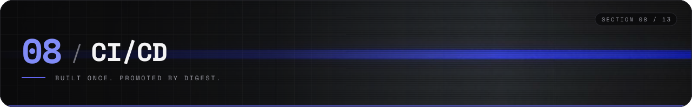
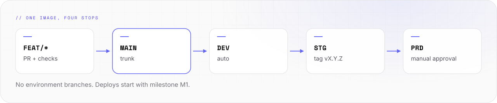

# CI/CD



How a change gets from a branch to production.

- **Today:** the shared CI is released as [synthwerk-blueprint](https://github.com/VelimirMueller/synthwerk-blueprint) v1. `synthwerk-sdk` uses it and is green.
- **Planned:** deploys start with milestone M1. No service deploys yet.

<picture>
  <source media="(prefers-color-scheme: dark)" srcset="../assets/docs/cicd-flow-v1-dark.svg">
  
</picture>

## The flow

```text
-- 01 ---------------------------------------------------------- FLOW --

 +----------+  PR + checks  +--------+     auto      +-------+
 |  feat/*  | ------------> |  main  | ------------> |  dev  |
 +----------+               +--------+               +---+---+
                                                         |
                                                         | tag vX.Y.Z
                                                         |
 +-------+   manual approval   +-------+                 |
 |  prd  | <------------------ |  stg  | <---------------+
 +-------+                     +-------+

  trunk-based: no env branches. one image, built once, promoted by digest.
```

## Continuous integration

Each repo calls the blueprint workflows at `@v1`. A repo does not copy them.

| Workflow | For | Checks |
|---|---|---|
| `ts-ci` | `synthwerk-sdk`, widgets, studio | Format and lint, type check, tests, build |
| `go-ci` | identity, llm, pulse | Format, lint, tests, build |
| `py-ci` | `synthwerk-vision` | Format and lint, tests |
| `image` | Each service | Build the container image once |
| `feature-doc` | Each repo | A changed feature has a changed feature doc |

- The exact steps of each workflow are in the [blueprint repo](https://github.com/VelimirMueller/synthwerk-blueprint/tree/main/.github/workflows).

- The workflows are pinned to commit hashes.
- Dependency updates wait 7 days after a release before they are proposed.
- A pull request needs green checks before it merges.

## Continuous delivery

| Step | Trigger | Result |
|---|---|---|
| Deploy to dev | Merge to `main` | The new image runs on dev |
| Deploy to stg | Tag `vX.Y.Z` | The same image runs on stg |
| Deploy to prd | Manual approval | The same digest runs on prd |
| Front-end preview | Pull request | A preview address per pull request |

- A rollback deploys the previous digest. It does not rebuild.
- The hosts are in [infrastructure.md](infrastructure.md).

## Checks in this repo

This repo has no code. Its checks cover the words and the links.

```bash
python3 scripts/check-ascii.py   # exit 0: all rules pass
scripts/check-links.sh           # exit 0: all links resolve
```

## Adopt the CI in a repo

- Read the [blueprint README](https://github.com/VelimirMueller/synthwerk-blueprint#readme).
- Copy a [caller workflow](https://github.com/VelimirMueller/synthwerk-blueprint/tree/main/examples/workflows).
- Check the [Definition of Done](https://github.com/VelimirMueller/synthwerk-blueprint/blob/main/docs/process/definition-of-done.md).
