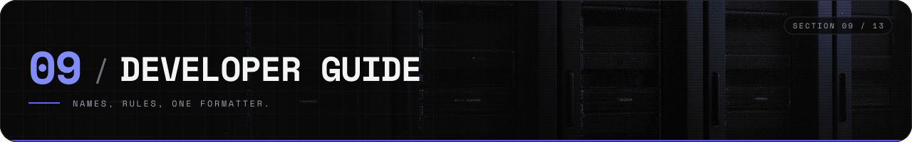
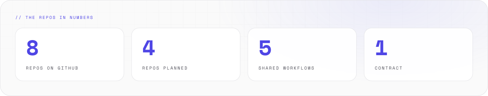

# Developer guide

How the Synthwerk repos are built, named and changed.

<picture>
  <source media="(prefers-color-scheme: dark)" srcset="../assets/docs/developer-stats-v1-dark.svg">
  
</picture>

## Repos

| Repo | Role | Language | State |
|---|---|---|---|
| [synthwerk](https://github.com/VelimirMueller/synthwerk) | The map and the docs | Markdown | working |
| [synthwerk-blueprint](https://github.com/VelimirMueller/synthwerk-blueprint) | Shared CI, lint configs, templates | YAML, JS | released, v1 |
| [synthwerk-sdk](https://github.com/VelimirMueller/synthwerk-sdk) | npm packages: tokens now, SDK later | TypeScript | tokens 0.2.0 |
| [synthwerk-vision](https://github.com/VelimirMueller/synthwerk-vision) | Image labels | Python | working |
| [synthwerk-identity](https://github.com/VelimirMueller/synthwerk-identity) | Orgs, roles, entitlements | Go | rewrite planned |
| [synthwerk-llm](https://github.com/VelimirMueller/synthwerk-llm) | LLM gateway, streaming chat, mascot | Go | rewrite planned |
| [synthwerk-widgets](https://github.com/VelimirMueller/synthwerk-widgets) | Chat and vision widgets | Vue | rewrite planned |
| [synthwerk-studio](https://github.com/VelimirMueller/synthwerk-studio) | Public site, builder, admin, health | Nuxt | rewrite planned |
| `synthwerk-contracts` | OpenAPI, event schemas, generated clients | OpenAPI, JSON Schema | planned |
| `synthwerk-infra` | Hosts, compose stack, edge, repo settings | OpenTofu | planned |
| `synthwerk-pulse` | Health, audit log, numbers | Go | planned |
| `synthwerk-e2e` | End-to-end tests across all services | Playwright | planned |

- "Rewrite planned" means the repo has a new README. The old code is at the tag `legacy-final`.
- A repo without a link does not exist yet.

## Names

| Thing | Pattern | Example |
|---|---|---|
| Repo | `synthwerk-<role>` | `synthwerk-llm` |
| npm package | `@synthwerk/<name>` | `@synthwerk/tokens` |
| Environment variable | `SYNTHWERK_<SERVICE>_<NAME>` | `SYNTHWERK_LLM_PROVIDER` |
| Shared setting | `SYNTHWERK_PLATFORM_<NAME>` | |
| Branch | `feat/<topic>`, `fix/<topic>`, `docs/<topic>` | `feat/docs-hub` |
| Release tag | `vX.Y.Z` | `v1.0.1` |

## Conventions

- **Trunk-based.** Branch from `main`. Merge by pull request. No environment branches.
- **One contract.** APIs and events are defined in `synthwerk-contracts`. Clients are generated from it.
- **Events for facts.** A service publishes facts as events. A question uses HTTP.
- **Scope on the token.** Each service checks the scope in the user's token. A prompt cannot change access.
- **Local-first.** Development uses local models. No paid AI provider is needed.
- **One formatter.** TypeScript repos use Biome for format and lint. Python repos use Ruff.
- **Feature docs.** A changed feature has a changed feature doc in the same pull request.

## A change, step by step

1. Take a task from the [issues](https://github.com/VelimirMueller/synthwerk/issues).
2. Create a branch from `main`.
3. Write the change and its tests.
4. Run the checks of the repo. Each README names them.
5. Open a pull request. Say what changed, why, and how to verify it.
6. Merge when the checks are green.

## Tests

| Level | Where | Runs |
|---|---|---|
| Unit and component | Each repo | On each pull request |
| Contract | Each service, against `synthwerk-contracts` | On each pull request |
| End-to-end | `synthwerk-e2e` | On dev after each deploy, planned |
| Eval | `synthwerk-vision`, later the mascot | On each pull request |

## More

- CI and deploys: [ci-cd.md](ci-cd.md).
- Hosts and data: [infrastructure.md](infrastructure.md).
- Colours and components: [design-system.md](design-system.md).
- README and banner rules: [presence-style.md](presence-style.md).
