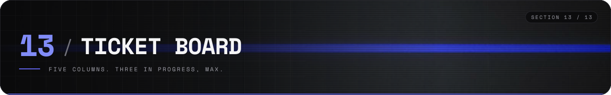
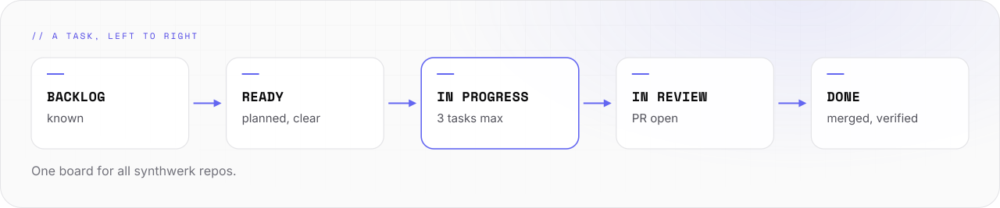

# Ticket board

The layout of the Synthwerk board on GitHub Projects. One board for all `synthwerk-*` repos.

- The board itself is private. The tasks are public: they are [issues](https://github.com/VelimirMueller/synthwerk/issues) in the repo that the work changes.
- The board collects the issues and adds status, track, roadmap, epic, priority and size.

<picture>
  <source media="(prefers-color-scheme: dark)" srcset="../assets/docs/board-flow-v1-dark.svg">
  
</picture>

## Columns

| Column | Meaning | A task leaves when |
|---|---|---|
| Backlog | Known, not planned | It gets a milestone and a size |
| Ready | Planned and clear | Work starts |
| In progress | Someone works on it | A pull request is open |
| In review | A pull request is open | The pull request is merged |
| Done | Merged and verified | Never |

- Keep "In progress" at 3 tasks or fewer.

## Fields

| Field | Values |
|---|---|
| Status | Backlog, Ready, In progress, In review, Done |
| Track | Product, Design system, Website, Infrastructure, Docs |
| Milestone | M0, M1, M2, M3, M4, M5, M6 |
| Epic | E0 to E8, or Design |
| Size | 1, 2, 3, 5, 8 |
| Priority | P0, P1, P2 |

## Views

| View | Shows |
|---|---|
| Board | All open tasks by status |
| Roadmap | Tasks by milestone on a timeline |
| By track | A table grouped by track |
| Design system | Only the track "Design system" |

## A good task

- The title says the result: `<Area>: <imperative sentence>`.
- The body has four parts: what and why, what to know, what must be true at the end, how to confirm it.
- The body does not say how to build it. That belongs in the pull request.
- One task fits in one sprint. Split a larger one.

## Board description

The board README repeats the links of the [docs index](README.md): design system, use cases, wiki, getting started, roadmap, demo, CI/CD, infrastructure, architecture, changelog, release notes, contribution guide, license, third-party tools, hosting and database, developer guide, stakeholder guide and feature catalogue.
