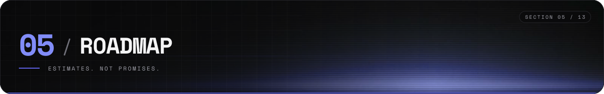
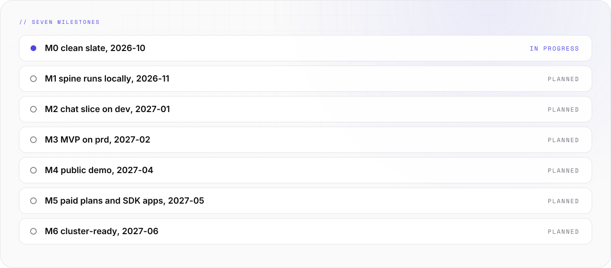

# Roadmap



Seven milestones, M0 to M6. Dates are estimates. Work is planned in two-week sprints.

```text
-- 01 -------------------------------------------------------- ROADMAP --

  M0       M1       M2       M3       M4       M5       M6
  [>>]-----[  ]-----[  ]-----[  ]-----[  ]-----[  ]-----[  ]
  2026-10  2026-11  2027-01  2027-02  2027-04  2027-05  2027-06
  clean    spine    chat     MVP      public   paid +   cluster
  slate    local    on dev   on prd   demo     SDK      ready

  [>>] in progress    [  ] planned    [##] done
```

<picture>
  <source media="(prefers-color-scheme: dark)" srcset="../assets/docs/roadmap-status-v1-dark.svg">
  
</picture>

## Milestones

| ID | Name | Date (estimate) | Epics | Proof |
|---|---|---|---|---|
| M0 | Clean slate | 2026-10-23 | E0 | Old names are removed. Blueprint CI is green in a repo |
| M1 | Spine runs locally | 2026-11-20 | E1 | `docker compose up` starts edge, bus, database, telemetry and pulse. All green |
| M2 | Chat slice on dev | 2027-01-29 | E2, E3 | A passkey user gets streamed answers in an embedded chat. A signed-out visitor triggers no AI call |
| M3 | MVP on prd | 2027-02-26 | E4 | prd runs the approved stg build. The 5-minute embed works. A restore drill is done |
| M4 | Public demo | 2027-04-09 | E5, E6 | Public site with live chat, vision and the mascot. Legal sign-off exists |
| M5 | Paid plans and SDK apps | 2027-05-07 | E7 | Test checkout changes entitlements. App templates for React and Vue pass their tests |
| M6 | Cluster-ready | 2027-06-04 | E8 | Same images on k3s. Security review closed. Card scan is correct on the eval set |

## Epics

| Epic | Name | Sprints | In MVP | Delivers |
|---|---|---|---|---|
| E0 | Clean slate | 1 | yes | Rename, security cleanup, blueprint, brand tokens |
| E1 | Spine | 2 | yes | Contracts, infra, edge, bus, observability, pulse skeleton |
| E2 | Identity | 2 | yes | Sign-in, orgs, apps, widget token, free entitlements |
| E3 | Chat slice | 2 | yes | LLM gateway, chat widget, SDK core, first end-to-end test |
| E4 | Studio core | 2 | yes | Admin, users, widget and AI settings, health view, prd |
| E5 | Vision | 1 | no | Vision widget, camera, tenant label sets |
| E6 | Builder and public site | 2 | no | Page builder, public site, consent, live demo, mascot |
| E7 | SDK apps, paywall, AI tools | 2 | no | React and Vue adapters, scaffold, paid plans, AI tools |
| E8 | Scale and hardening | 2 | no | k3s, fallback provider, alerts, card scan |

## Sprint calendar

| Sprint | Dates (estimate) | Epic |
|---|---|---|
| S1 | 2026-10-12 to 2026-10-23 | E0 |
| S2, S3 | 2026-10-26 to 2026-11-20 | E1 |
| S4, S5 | 2026-11-23 to 2026-12-18 | E2 |
| none | 2026-12-21 to 2027-01-01 | Buffer |
| S6, S7 | 2027-01-04 to 2027-01-29 | E3 |
| S8, S9 | 2027-02-01 to 2027-02-26 | E4 |
| S10 | 2027-03-01 to 2027-03-12 | E5 |
| S11, S12 | 2027-03-15 to 2027-04-09 | E6 |
| S13, S14 | 2027-04-12 to 2027-05-07 | E7 |
| S15, S16 | 2027-05-10 to 2027-06-04 | E8 |

## Design track

The design system runs beside the epics. It has no milestone of its own yet.

| Step | Result | State |
|---|---|---|
| D1 | `@synthwerk/tokens` with group accents | released, 0.2.0 |
| D2 | Figma library: tokens as variables, type styles, base components | planned |
| D3 | `synthwerk-ui` package: the Figma components in code | planned |
| D4 | Studio and widgets use `synthwerk-ui` | planned, with E3 and E4 |

## Where the work is tracked

- Tasks: the [ticket board](https://github.com/VelimirMueller/synthwerk/projects). Its layout is in [project-board.md](project-board.md).
- Shipped changes: [CHANGELOG.md](../CHANGELOG.md) and [release-notes.md](release-notes.md).
- Targets are estimates. Estimates are not promises.
